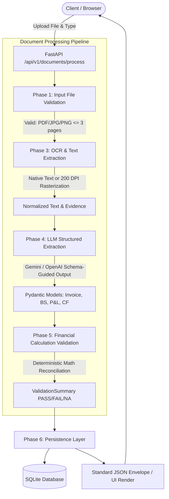

# Document Intelligence Extraction, Validation & API Platform

An enterprise-grade document intelligence system that ingests financial documents and invoices, extracts text using a hybrid OCR pipeline, performs structured extraction using LLMs into strict Pydantic schemas, runs deterministic mathematical verification across all financial calculations, persists records in a database, and exposes RESTful API endpoints and a web dashboard.

Built for the **AI Engineer Internship Technical Assessment**.

---

## 🌟 Key Features

1. **Document Control & Validation (Phase 1)**:
   - Enforces file constraints before OCR/LLM: MIME type verification (`application/pdf`, `image/jpeg`, `image/png`), corrupt/unreadable file detection, and a strict **3-page maximum limit**.
   - Safe client-facing error envelopes with standardized machine-readable codes.

2. **Unified OCR & Text Extraction Pipeline (Phase 3)**:
   - Hybrid per-page text extractor: extracts native PDF text via `pdfplumber`/`PyMuPDF`, detecting vector-drawn PDFs (zero font glyphs).
   - High-fidelity rasterization fallback at 200 DPI via `fitz` + `pytesseract` OCR (with in-process fallback to `rapidocr_onnxruntime`).
   - Page-level tracking preserving verbatim source snippets and 1-indexed page coordinates.

3. **Schema-Guided Structured Extraction (Phase 4)**:
   - Supports 4 document types:
     - `invoice`: Numbers, dates, vendor/customer, totals, currency, and line items.
     - `balance_sheet`: Capital, liabilities, assets, comparative periods, and line items.
     - `profit_and_loss`: Incomes, expenditures, operating/net profit, appropriations, and line items.
     - `cash_flow_statement`: Operating, investing, financing cash flows, net changes, and cash balances.
   - Grounded fields with `value`, `confidence`, `source_text`, and `page_number`.
   - **Zero Hallucination Rule**: Missing values are strictly returned as `null` (never guessed, estimated, or defaulted).

4. **Deterministic Financial Validation (Phase 5)**:
   - Performs exact mathematical reconciliation on extracted values:
     - **Invoices**: `quantity * unit_price == line_total`, `subtotal + tax - discount == total_amount`, and `cash_paid - total_amount == change`.
     - **Balance Sheets**: `total_capital_and_liabilities == total_assets`, component sums of liabilities and assets.
     - **Profit & Loss**: `interest_earned + other_income == total_income`, `total_income - total_expenditure == net_profit`, and net profit to appropriation reconciliation.
     - **Cash Flow**: `operating + investing + financing + fx == net_increase_in_cash`, `opening_cash + net_increase == closing_cash`.
   - Clear outcomes: `PASS`, `FAIL` (with variance), or `NOT_APPLICABLE` (when required operands are not present).

5. **SQLAlchemy Database & Persistence (Phase 6)**:
   - Persistent `DocumentRecord` schema storing processing status, validation outcomes, confidence scores, raw OCR text, structured JSON, and audit metadata.
   - High-performance query indexes on document name and creation timestamp.

6. **FastAPI Endpoints & Error Envelopes (Phase 7)**:
   - `POST /api/v1/documents/process`: Multipart file upload executing the complete pipeline.
   - `GET /api/v1/documents/{document_name}`: Retrieve the latest processed result by filename.
   - `GET /api/v1/documents`: Paginated list of processed documents with optional type/status filters.
   - `GET /api/v1/health`: Health status and model configuration check.
   - Interactive OpenAPI documentation served at `/docs` and `/redoc`.

7. **Interactive Dashboard & UI (Phase 8)**:
   - Built with modern Jinja2 templates, vanilla CSS glassmorphism, responsive tables, and drag-and-drop file upload.
   - Detailed inspection view displaying validation check breakdowns with computed variances, audit metadata, and a color-coded JSON inspector.

---

## 🏛️ System Architecture



> **Note**: A static PNG version of this diagram is also available at [`docs/architecture_diagram.png`](docs/architecture_diagram.png) for environments that do not render Mermaid.

---

## 📋 Technology Stack

- **Backend**: Python 3.11, FastAPI, Uvicorn, Pydantic v2, Pydantic-Settings
- **Persistence**: SQLAlchemy 2.0, SQLite
- **OCR / Document Processing**: PyMuPDF (`fitz`), `pdfplumber`, `pypdf`, `Pillow`, `pytesseract`, `rapidocr-onnxruntime`
- **LLM Providers**: `google-genai` (Google Gemini), `openai`
- **Frontend**: Jinja2 Templates, HTML5, Vanilla CSS (Modern Dark Mode / Glassmorphism), Vanilla JavaScript
- **Testing**: Pytest, Pytest-Asyncio, HTTPX

---

## 🚀 Quickstart & Local Setup

### 1. Prerequisites
- Python 3.10+ (tested on Python 3.11)
- Tesseract OCR installed:
  - **Windows**: `winget install --id UB-Mannheim.TesseractOCR` (Default path: `C:\Program Files\Tesseract-OCR\tesseract.exe`)
  - **Linux / Ubuntu**: `sudo apt-get install -y tesseract-ocr`
  - **macOS**: `brew install tesseract`

### 2. Installation
Clone the repository and install backend dependencies:
```bash
git clone https://github.com/Rahulkamar07/Neostat.git
cd Neostat

# Create and activate virtual environment
python -m venv .venv
# On Windows:
.venv\Scripts\activate
# On Linux/macOS:
source .venv/bin/activate

# Install requirements
pip install -r backend/requirements.txt
```

### 3. Configure Environment Variables
Copy `.env.example` to `.env`:
```bash
copy .env.example .env   # On Windows
cp .env.example .env     # On Linux/macOS
```

Edit `.env` to supply your Gemini or OpenAI API key:
```ini
LLM_PROVIDER=gemini
GEMINI_API_KEY=your_gemini_api_key_here
GEMINI_MODEL=gemini-3.5-flash-lite

# Optional: Tesseract path on Windows if not on PATH
TESSERACT_CMD=C:\Program Files\Tesseract-OCR\tesseract.exe
```

### 4. Run the Application
From the `backend/` directory:
```bash
cd backend
python -m uvicorn app.main:app --host 127.0.0.1 --port 8000 --reload
```

Open your browser:
- **Interactive Web Dashboard**: [http://localhost:8000/](http://localhost:8000/)
- **Swagger / OpenAPI Documentation**: [http://localhost:8000/docs](http://localhost:8000/docs)
- **ReDoc Documentation**: [http://localhost:8000/redoc](http://localhost:8000/redoc)

---

## 🧪 Running Automated Tests

Run the complete test suite:
```bash
cd backend
pytest -v
```

To run the fast unit tests (skipping heavy 200 DPI OCR tests):
```bash
pytest -v -k "not test_ocr"
```

All 45+ test cases validate:
- MIME types, empty files, corrupt files, and page limits.
- OCR vector-drawn and raster image extractions.
- Pydantic schema validation across all 4 document types.
- Deterministic calculation checks (PASS, FAIL, and NOT_APPLICABLE cases).
- Database CRUD and repository operations.
- Full API pipeline integration and standard error envelopes.

---

## 📡 API Reference

### 1. Process Document
`POST /api/v1/documents/process` (Status `201 Created`)

**Request**: `multipart/form-data`
- `file`: Document file (PDF, JPG, PNG &bull; max 3 pages &bull; max 15MB)
- `document_type`: One of `invoice`, `balance_sheet`, `profit_and_loss`, `cash_flow_statement`

**Sample Response**:
```json
{
  "data": {
    "id": 1,
    "document_name": "invoice_sample.pdf",
    "document_type": "invoice",
    "file_type": "application/pdf",
    "page_count": 1,
    "file_size_bytes": 45120,
    "processing_status": "PROCESSED",
    "validation_status": "PASS",
    "overall_confidence": 0.98,
    "extracted_data": {
      "invoice_number": {
        "value": "INV-2024-001",
        "confidence": 0.99,
        "evidence": { "source_text": "Invoice # INV-2024-001", "page_number": 1 }
      },
      "total_amount": {
        "value": 1500.0,
        "confidence": 0.98,
        "evidence": { "source_text": "Total Due: $1,500.00", "page_number": 1 }
      }
    },
    "validation_summary": {
      "overall_status": "PASS",
      "checks": [
        {
          "name": "invoice_subtotal_tax_reconciliation",
          "formula": "subtotal + tax - discount = total_amount",
          "operands": { "subtotal": 1350.0, "tax_amount": 150.0, "discount": 0.0, "total_amount": 1500.0 },
          "calculated_value": 1500.0,
          "reported_value": 1500.0,
          "variance": 0.0,
          "status": "PASS"
        }
      ],
      "issues": []
    },
    "processing_metadata": {
      "processing_time_seconds": 1.84,
      "ocr_used": false,
      "llm_provider": "gemini",
      "llm_model": "gemini-3.5-flash-lite"
    }
  }
}
```

### 2. Retrieve Latest Document by Name
`GET /api/v1/documents/{document_name}`

Returns the latest extraction and validation record matching `{document_name}`.

### 3. List Processed Documents
`GET /api/v1/documents?skip=0&limit=50&document_type=balance_sheet&validation_status=PASS`

Returns a paginated list of documents with metadata.

### 4. Health Check
`GET /api/v1/health`

Returns service status, database connectivity, and configured LLM provider.

### Error Envelope Specification
All validation and runtime errors return standardized HTTP status codes with the envelope:
```json
{
  "error": {
    "code": "PAGE_LIMIT_EXCEEDED",
    "message": "Documents must not exceed 3 pages.",
    "details": {
      "file_name": "annual_report.pdf",
      "page_count": 4,
      "max_pages": 3
    }
  }
}
```

---

## 📦 Sample Outputs

Pre-extracted live outputs for all 4 document categories from the benchmark dataset are saved in [`sample_outputs/`](sample_outputs/):
- `sample_outputs/invoice_sample.json`: Extracted invoice with line items, tax, and grounding evidence.
- `sample_outputs/balance_sheet_sample.json`: Consolidated balance sheet with comparative periods (`2017` and `2016`).
- `sample_outputs/profit_loss_sample.json`: Consolidated P&L statement with comparative income, expenditures, and appropriation breakdown.
- `sample_outputs/cash_flow_sample.json`: Multi-page cash flow statement with operating, investing, and financing reconciliation.

---

## 🚢 Production Deployment

### Deploying to Render / Railway / Cloud Run
1. **Dockerfile**: A standard production `Dockerfile` should install `tesseract-ocr` via `apt-get`:
   ```dockerfile
   FROM python:3.11-slim
   RUN apt-get update && apt-get install -y --no-install-recommends \
       tesseract-ocr \
       libtesseract-dev \
       && rm -rf /var/lib/apt/lists/*
   WORKDIR /app
   COPY backend/requirements.txt .
   RUN pip install --no-cache-dir -r requirements.txt
   COPY . .
   WORKDIR /app/backend
   CMD ["uvicorn", "app.main:app", "--host", "0.0.0.0", "--port", "8000"]
   ```
2. **Environment Variables**: Configure `GEMINI_API_KEY`, `LLM_PROVIDER=gemini`, and `DATABASE_URL` in the cloud provider's dashboard settings.
